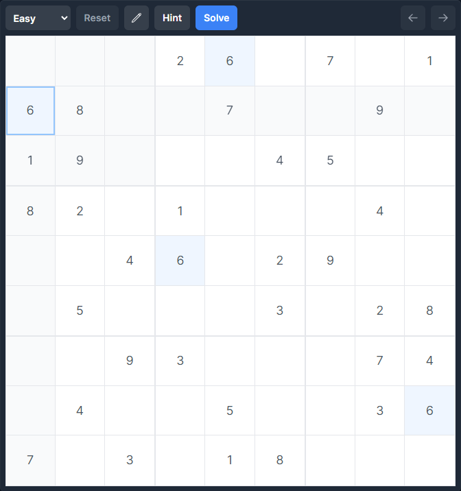

# 🔢 Sudoku Solver

This is a fully featured, playable Sudoku board and solver. It includes an interactive Sudoku board with cell highlighting, draft mode toggle, and undo and redo buttons. You have the option to solve the puzzle step by step or to solve the entire puzzle at once. Try it out [here](https://mwpryer.github.io/sudoku-solver/).

    

## Features

- Fully interactive board with cell highlighting
- Draft mode toggle for testing possible numbers
- Undo and redo buttons
- Solve puzzles step by step or solve the entire puzzle at once
- Ability to input and solve your own Sudoku puzzles
- Preloaded Sudoku puzzles of varying difficulties
- Optimized for both desktop and mobile use

## Technologies

Built with JavaScript, HTML, and Tailwind CSS.

The `Sudoku` class is responsible for the puzzle-solving logic and includes utilities for managing the board's code representation. The `SudokuDOM` class manages the display of the board in the DOM.
